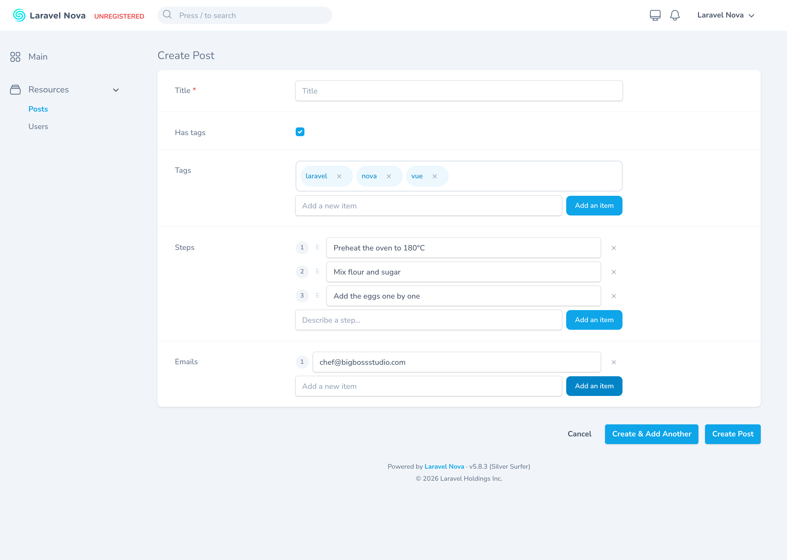
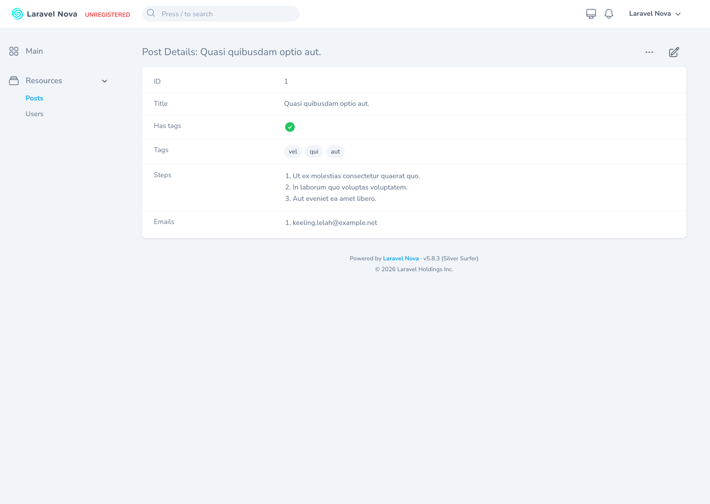
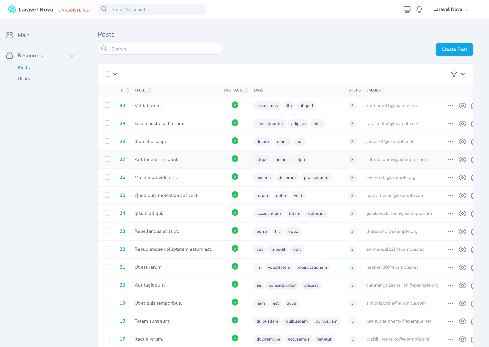

# Nova Items Field

[](https://packagist.org/packages/bbs-lab/nova-items-field)
[](https://github.com/BBS-Lab/nova-items-field/actions)
[](https://packagist.org/packages/bbs-lab/nova-items-field)

A modern [Laravel Nova 5](https://nova.laravel.com) field for managing a **list of scalar values**
(tags, emails, steps, bullet points…) stored as JSON in a single column.

It is a complete, modernized rewrite of [`blendbyte/nova-items-field`](https://github.com/blendbyte/nova-items-field)
(itself a fork of `dillingham/nova-items-field`): same feature set, a cleaner API, a polished UI,
first-class validation, internationalization, and **100% test coverage** on both the PHP and the
JavaScript side.

## Features

- 🎛️ Two display modes: **structured rows** (numbered, drag-to-reorder) or **chips/tags**
- ✅ First-class validation: array-level `rules()` **and** per-item `itemRules()` with inline,
  per-row error messages
- 🔢 `min()` / `max()` item constraints
- 🧲 Drag-and-drop reordering, scrollable lists, custom input types, datalist suggestions
- 🌍 Localized labels (English & French out of the box, publishable)
- 🧩 Dependent fields (`dependsOn`) and copy-to-clipboard support
- 👀 Tailored index & detail rendering: count badge with tooltip, chips overflow, or truncated list
- 🧪 100% PHP coverage, 100% JS coverage, mutation tested, PHPStan level 8

## Screenshots

**Create / edit form** — structured rows and chips modes together, with inline add controls and drag handles:



**Detail view** — readonly chips and an ordered list, in Nova's native field layout:



**Index view** — count badge (with a hover tooltip), chips overflow and truncated list across the table:



## Requirements

- PHP `^8.4`
- Laravel Nova `^5.0`
- Laravel `^11.0 || ^12.0 || ^13.0`

## Installation

Because Nova is a paid, private package, make sure your application is already authenticated against
`nova.laravel.com`, then:

```bash
composer require bbs-lab/nova-items-field
```

The field auto-registers via Laravel package discovery. Optionally publish the config and translations:

```bash
php artisan vendor:publish --tag=nova-items-field-config
php artisan vendor:publish --tag=nova-items-field-translations
```

Add an array cast to the underlying model attribute (a `json`/`text` column):

```php
protected $casts = [
    'tags' => 'array',
];
```

## Quick start

```php
use BBSLab\NovaItemsField\Items;

public function fields(NovaRequest $request): array
{
    return [
        Items::make('Tags')
            ->chips()
            ->suggestions(['laravel', 'nova', 'vue'])
            ->rules('max:10')
            ->itemRules('string', 'max:255'),
    ];
}
```

## Usage

### Display modes

```php
Items::make('Steps');            // structured numbered rows (default)
Items::make('Tags')->chips();    // chips / tags
```

### Reordering, sizing & input

```php
Items::make('Steps')
    ->draggable()                // drag handle to reorder
    ->min(1)->max(10)            // bounds (validated + reflected in the UI)
    ->maxHeight(300)             // scrollable list (px)
    ->inputType('email')         // any HTML input type
    ->placeholder('Add a step…')
    ->fullWidth();
```

### Buttons

```php
Items::make('Tags')
    ->addButtonLabel('Add a tag')
    ->deleteButtonLabel('Remove')
    ->addButtonPosition('top')   // 'top' or 'bottom' (default)
    ->hideAddButton();           // hide the add control entirely
```

### Validation

`rules()` validates the **list as a whole**; `itemRules()` validates **each item**. Failures are
shown inline, per row:

```php
Items::make('Emails')
    ->rules('required', 'max:5')   // the list: required, at most 5 items
    ->itemRules('email');          // each item must be a valid email
```

### Index & detail rendering

```php
// Index (table cell) — defaults to a count badge with a hover tooltip:
Items::make('Tags')->indexAsChips();  // first chips + "+N" overflow
Items::make('Tags')->indexAsList();   // truncated, comma-joined text

// Detail — mirrors the form mode (list or chips); or summarize:
Items::make('Steps')->detailsAsTotal();
```

### Dependent fields & clipboard

```php
use Laravel\Nova\Fields\FormData;
use Laravel\Nova\Http\Requests\NovaRequest;

Items::make('Tags')
    ->copyable()
    ->dependsOn('has_tags', function (Items $field, NovaRequest $request, FormData $formData) {
        $formData->boolean('has_tags') ? $field->show() : $field->hide();
    });
```

## Migrating from `blendbyte/nova-items-field`

The API was modernized — there are **no compatibility aliases**. Update your field definitions:

| `blendbyte/nova-items-field`            | `bbs-lab/nova-items-field`                  |
| --------------------------------------- | ------------------------------------------- |
| `NovaItemsField\Items`                  | `BBSLab\NovaItemsField\Items`               |
| `->values([...])`                       | `->suggestions([...])`                      |
| `->createButtonValue('Add')`            | `->addButtonLabel('Add')`                   |
| `->deleteButtonValue('x')`              | `->deleteButtonLabel('x')`                  |
| `->hideCreateButton()`                  | `->hideAddButton()`                         |
| `->listFirst()`                         | `->addButtonPosition('top')`                |
| `->rules([null => '...', '*' => '...'])`| `->rules('...')` + `->itemRules('...')`     |
| `asHtml` (broken upstream)              | removed — use Nova's native `displayUsing()`|

## Local development

This package ships an embedded Nova application (via [Orchestra Workbench](https://github.com/orchestral/workbench))
so you can exercise the field in a real Nova instance:

```bash
composer install
npm install
npm run build
composer serve        # boots Nova at http://localhost:8000/nova
```

## Quality & testing

| Gate                 | Command                  |
| -------------------- | ------------------------ |
| PHP tests (100% cov) | `composer test-coverage` |
| Mutation testing     | `composer test-mutation` |
| Static analysis (L8) | `composer analyse`       |
| Code style           | `composer format`        |
| JS tests (100% cov)  | `npm run test:coverage`  |

## Changelog

Please see [CHANGELOG](CHANGELOG.md) for what has changed recently.

## Contributing

Please see [CONTRIBUTING](CONTRIBUTING.md) for details.

## Security

Please review [our security policy](SECURITY.md) on how to report security vulnerabilities.

## Credits

- [Big Boss Studio](https://github.com/BBS-Lab)
- Original work by [blendbyte](https://github.com/blendbyte/nova-items-field) and
  [dillingham](https://github.com/dillingham/nova-items-field)

## License

The MIT License (MIT). Please see [License File](LICENSE.md) for more information.
